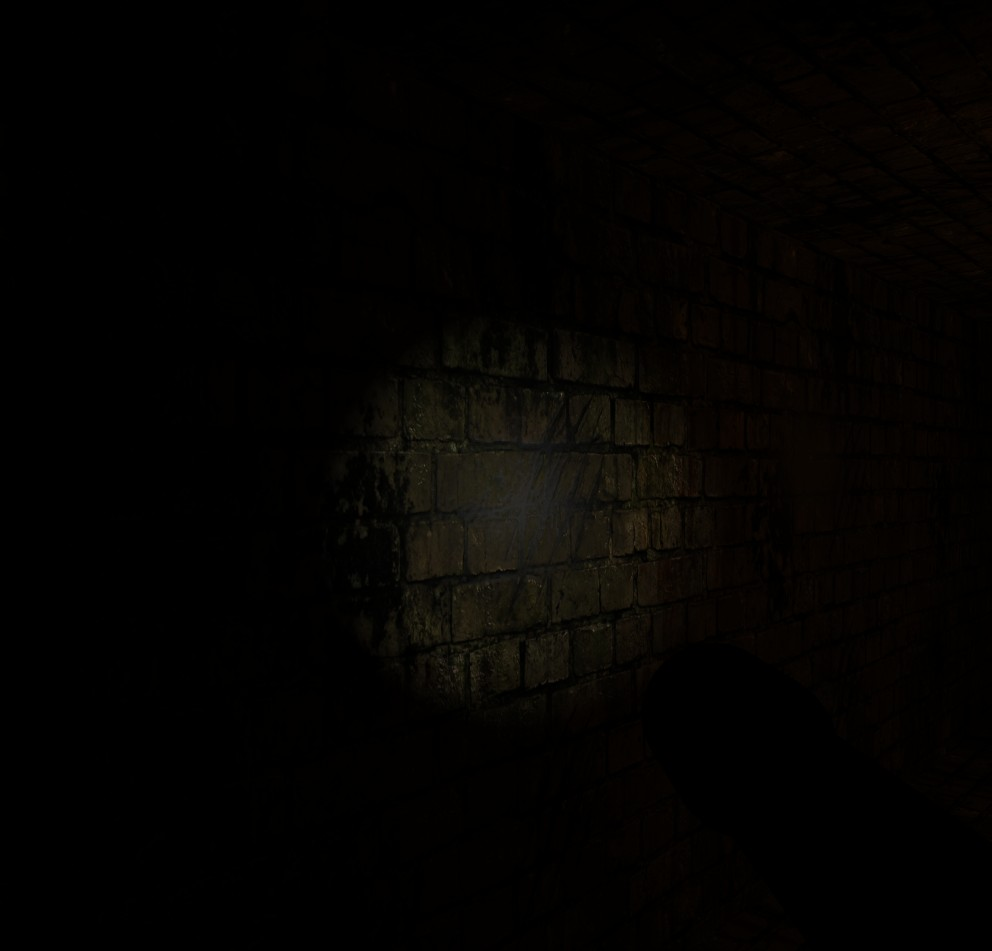
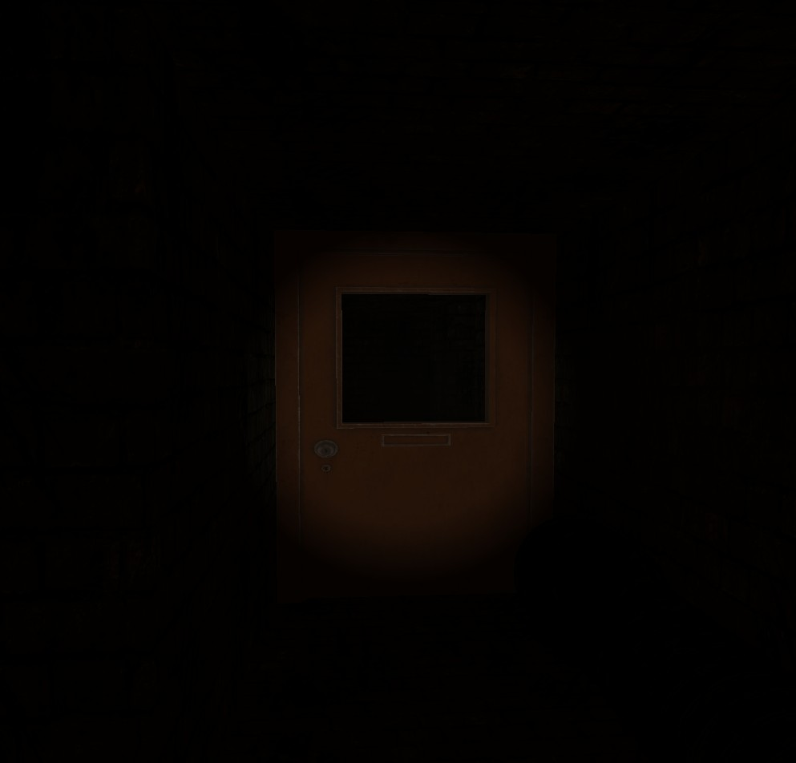
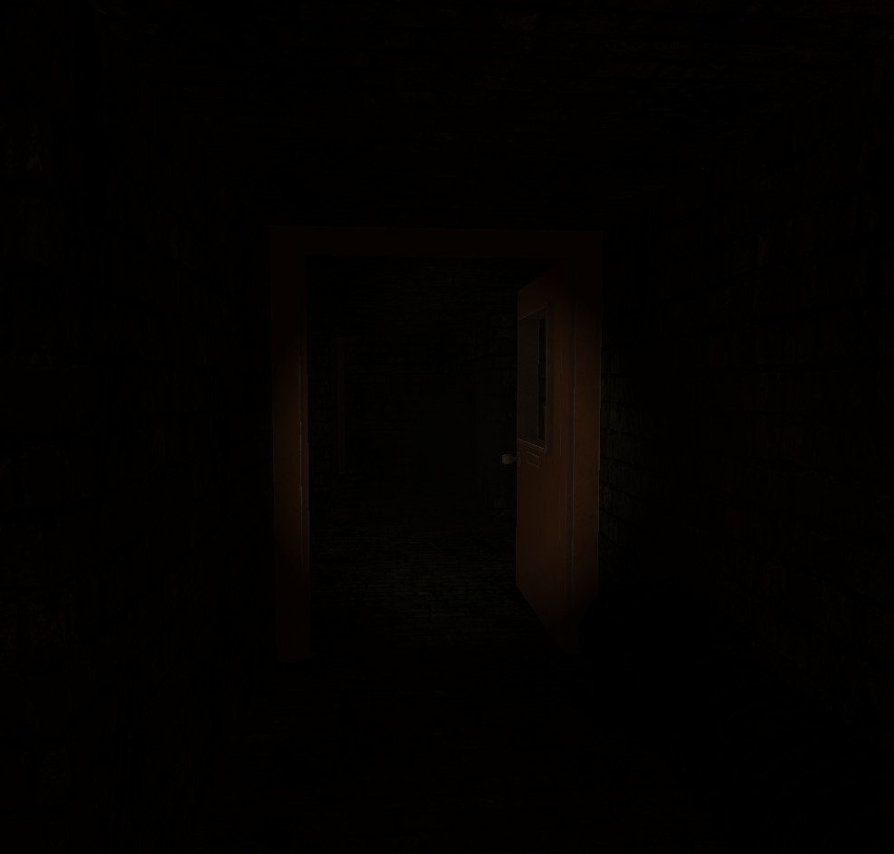
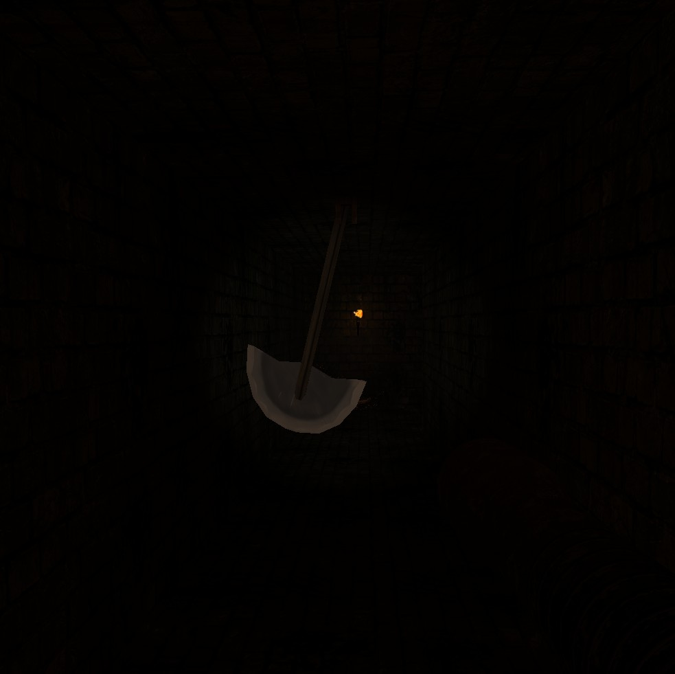
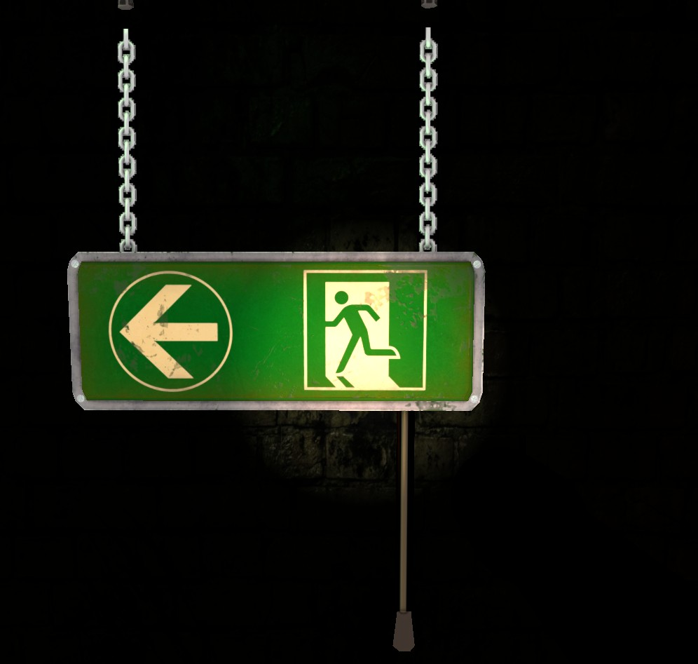
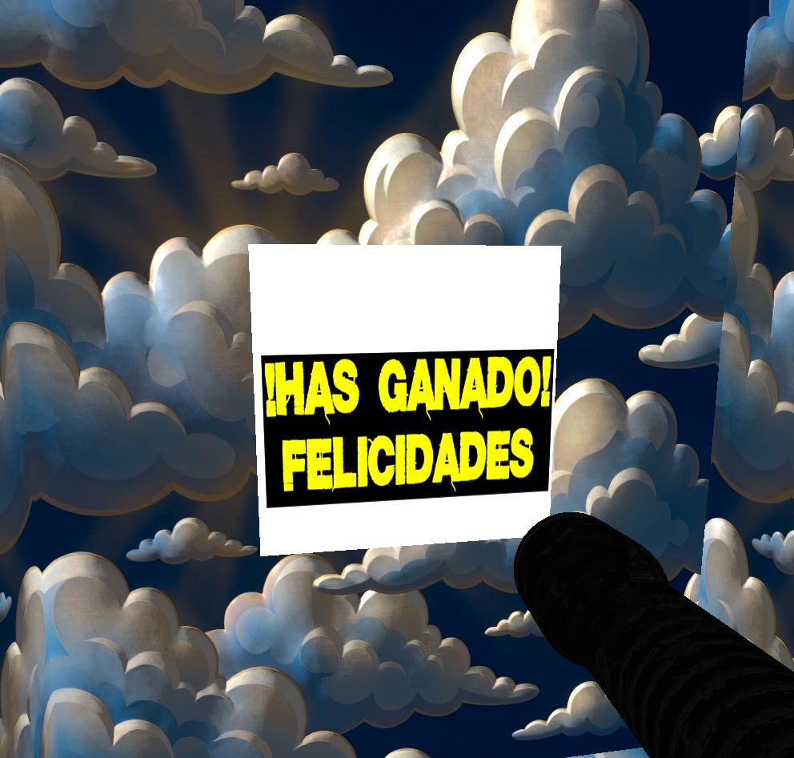

# 🎮 PHOBIA - Manual de Usuario

## Laberinto de Terror en Primera Persona

---


*Figura 1: Portada del Juego*

---

## 📖 Historia

> *Despiertas en la oscuridad más absoluta. El frío del suelo de piedra te cala los huesos mientras tus ojos intentan adaptarse a la penumbra. No recuerdas cómo llegaste aquí, pero una cosa está clara: **debes escapar**.*
>
> *En tu mano derecha encuentras una vieja linterna. Su luz temblorosa es todo lo que te separa de la oscuridad total. Los pasillos se extienden ante ti como las fauces de una bestia hambrienta.*
>
> *Escuchas un sonido metálico... algo se balancea en la oscuridad. Las cuchillas del péndulo brillan bajo la luz de tu linterna. Un paso en falso y...*
>
> *Encuentra la salida. Sobrevive. **Escapa de Phobia.***

---

## 🎯 Objetivo

Tu único objetivo es **encontrar la salida del laberinto** y escapar con vida.

Para lograrlo deberás:
- 🔦 Usar tu linterna para iluminar el camino
- 🚪 Abrir puertas que bloquean tu paso
- ⚠️ Evitar los mortales péndulos oscilantes
- 🧭 Orientarte en la oscuridad sin perderte

---

## 🕹️ Controles

### Movimiento

| Tecla | Acción |
|:-----:|--------|
| **W** | Caminar hacia adelante |
| **A** | Desplazarte a la izquierda |
| **S** | Caminar hacia atrás |
| **D** | Desplazarte a la derecha |

### Cámara

| Control | Acción |
|:-------:|--------|
| **Mover el ratón** | Girar la vista / Apuntar la linterna |

### Interacción

| Tecla | Acción |
|:-----:|--------|
| **E** | Interactuar (abrir puertas cercanas) |
| **F** | Apagar/Encender la linterna |
| **U** | Abrir/Cerrar minimapa |
| **ESC** | Salir del juego |

---

## 🔦 La Linterna

Tu linterna es tu **única fuente de luz** en este laberinto de pesadilla.


*Figura 2: Linterna en acción*

### Características:
- **Control manual**: Puedes encenderla y apagarla con la tecla **F**
- **Apunta donde miras**: La luz sigue la dirección de tu vista
- **Movimiento realista**: Se balancea sutilmente mientras caminas

> 💡 **Consejo**: Mueve lentamente el ratón para inspeccionar las paredes y encontrar puertas ocultas en la oscuridad. Apaga la linterna en momentos de calma para añadir tensión a la experiencia.

---

## 🚪 Las Puertas

A lo largo del laberinto encontrarás **puertas cerradas** que bloquean tu camino.


*Figura 3: Puerta cerrada*

### Cómo abrir una puerta:

1. **Acércate** a la puerta hasta estar a poca distancia
2. **Apunta** hacia ella con tu linterna
3. **Presiona E** para abrirla
4. La puerta se abrirá girando 90 grados


*Figura 4: Puerta abierta*

> ⚠️ **Atención**: Solo puedes interactuar con puertas cuando estás lo suficientemente cerca. Si presionas E y no pasa nada, acércate más.

---

## ⚔️ Peligros: El Péndulo de la Muerte

El laberinto esconde **trampas mortales**: enormes cuchillas que oscilan de lado a lado, cortando todo a su paso.


*Figura 5: Péndulo oscilante*

### Cómo sobrevivir:

| ✅ Haz esto | ❌ No hagas esto |
|------------|-----------------|
| Observa el patrón de oscilación | Correr a ciegas |
| Espera el momento adecuado | Intentar pasar cuando la cuchilla viene hacia ti |
| Pasa rápido cuando esté en el extremo | Quedarte parado debajo |

> 🎮 **Estrategia**: Los péndulos tienen un ritmo constante. Cuenta los segundos entre cada oscilación y cruza cuando la cuchilla esté en el punto más alejado de tu camino.

---

## 🗺️ Navegando el Laberinto

El laberinto es oscuro y confuso por diseño. Aquí tienes algunos consejos:

### Consejos de Orientación

1. **Mantén una pared**: Sigue siempre la pared derecha (o izquierda) para no dar vueltas en círculos.

2. **Memoriza intersecciones**: Presta atención a detalles únicos en cada cruce.

3. **Busca señales de salida**: Las luces de emergencia te guiarán hacia la salida.


*Figura 6: Señal de salida*

4. **Escucha**: El sonido ambiente puede darte pistas sobre lo que hay adelante.

---

## 🏁 La Salida

Cuando encuentres la salida, lo sabrás. Una luz diferente te espera al final del laberinto.


*Figura 7: Zona de salida*

> 🎉 **¡Felicidades!** Si llegas hasta aquí, habrás completado **Phobia** y escapado del laberinto de terror.

---


## ❓ Preguntas Frecuentes

### ¿Puedo morir en el juego?
No, pero los péndulos son peligrosos. Evítalos a toda costa.

### ¿La linterna se puede apagar?
Sí, puedes apagarla y encenderla presionando la tecla **F**. Esto te permite controlar cuándo usar la luz y cuándo adentrarte en la oscuridad total.

### ¿Hay un minimapa?
Sí, puedes activar un minimapa presionando la tecla **U** para ayudarte a orientarte en el laberinto.

### ¿Cuánto dura el juego?
Depende de tu habilidad para orientarte. Una partida típica dura entre 5 y 15 minutos.

### El juego va lento, ¿qué hago?
Asegúrate de que tu sistema cumple los requisitos mínimos y que tienes los drivers gráficos actualizados.

---

## 🔧 Solución de Problemas

| Problema | Solución |
|----------|----------|
| Pantalla en negro | Verifica que tu GPU soporta OpenGL 3.3 |
| No encuentra recursos | Ejecuta el juego desde la carpeta `binary/` |
| Controles no responden | Haz clic en la ventana del juego para darle foco |
| FPS muy bajos | Cierra otras aplicaciones que usen la GPU |

---

### 🧠 Características Técnicas y Cumplimiento de Requisitos

Esta sección demuestra cómo **Phobia** cumple de forma **explícita y completa** con todos los requisitos mínimos obligatorios de la práctica final.

---

## ✅ REQUISITO 1: Sistema Compuesto de Varios Objetos Articulados

**📋 Requisito de la práctica:**
> *"Debe ser un sistema compuesto de varios objetos articulados. En este sentido no se considerará válido un sistema compuesto por el mismo objeto replicado varias veces, como el sistema solar."*

### ✓ Cumplimiento Demostrado:

**Phobia** implementa **dos tipos diferentes de objetos articulados**, cada uno con jerarquía de transformaciones clara y propósito único en la escena:

#### 1. **Péndulos de la Muerte** (`PendulumManager.cpp`)
   - **Estructura jerárquica:** Compuesto por dos elementos articulados con relación padre-hijo:
     - **Base superior fija** (nodo padre): Anclaje estático en el techo del laberinto
     - **Cuchilla oscilante** (nodo hijo): Hereda la transformación del padre y aplica rotación adicional
   
   - **Transformaciones anidadas:**
     ```
     M_final = M_posición_mundo × M_rotación_base × M_rotación_cuchilla × M_offset_pivote
     ```
     La cuchilla rota alrededor de un punto de anclaje superior (pivote), heredando la posición mundial de la base y aplicando su propia rotación oscilatoria.
   
   - **Grados de libertad:** 
     - Rotación sobre eje Z (perpendicular al pasillo)
     - Amplitud configurable (`PENDULUM_SWING_ANGLE` = ±45°)
     - Velocidad ajustable (`PENDULUM_SPEED`)
   
   - **Movimiento:** Oscilación sinusoidal automática basada en tiempo real
     ```cpp
     float angle = PENDULUM_SWING_ANGLE * sin(currentTime * PENDULUM_SPEED);
     ```
   
   - **Instancias en escena:** Múltiples péndulos distribuidos estratégicamente por el laberinto (cada uno es una instancia independiente con sus propias transformaciones)

#### 2. **Puertas Interactivas** (`DoorManager.cpp`)
   - **Estructura jerárquica:** Cada puerta articula sobre bisagras verticales:
     - **Marco fijo** (nodo padre): Posición y orientación estática en las paredes del laberinto
     - **Hoja de la puerta** (nodo hijo): Rota 90° sobre eje Y (vertical) respecto a las bisagras al ser activada
   
   - **Transformaciones anidadas:**
     ```
     M_final = M_posición_marco × M_rotación_bisagra × M_offset_hoja
     ```
     La hoja mantiene su posición relativa al marco mientras rota alrededor del eje de las bisagras.
   
   - **Grados de libertad:**
     - Rotación sobre eje Y (vertical)
     - Rango de movimiento: 0° (cerrada) a 90° (abierta)
     - Interpolación suave para transición realista
   
   - **Movimiento:** Rotación interpolada activada por el jugador al presionar 'E'
     ```cpp
     currentAngle = lerp(0.0f, 90.0f, interpolationFactor);
     ```
   
   - **Instancias en escena:** Múltiples puertas de diferentes tipos distribuidas por el laberinto:
     - Puertas normales (madera)
     - Puertas de salida de emergencia (metal con barra antipánico)

### 📊 Comparativa de Objetos Articulados:

| Característica | Péndulo | Puertas |
|---------------|---------|---------|
| **Nodo padre (fijo)** | Base de anclaje en techo | Marco en pared |
| **Nodo hijo (móvil)** | Cuchilla oscilante | Hoja giratoria |
| **Eje de rotación** | Eje Z (horizontal) | Eje Y (vertical) |
| **Tipo de movimiento** | Automático (sinusoidal) | Manual (interacción con 'E') |
| **Rango de movimiento** | ±45° continuo | 0° a 90° (una vez) |
| **Instancias en escena** | Múltiples (trampas) | Múltiples (accesos) |

**🔍 Archivos de implementación:**
- `PendulumManager.cpp/h`: Gestión de péndulos con jerarquía base-cuchilla y animación automática
- `DoorManager.cpp/h`: Gestión de puertas con jerarquía marco-hoja e interacción por raycasting
- `Model.cpp`: Carga de geometría de componentes articulados
- `Shaders.cpp`: Envío de matrices de transformación compuestas a GPU

**✅ Conclusión:** El sistema implementa **2 tipos completamente diferentes de objetos articulados** (péndulo y puertas), cada uno con **múltiples instancias en la escena** (varios péndulos + varias puertas = sistema compuesto de varios objetos articulados). Ambos tipos tienen jerarquías de transformación distintas, propósitos diferentes (trampa vs acceso) y mecanismos de activación únicos (automático vs manual), cumpliendo plenamente con el requisito de "varios objetos articulados" no replicados.

---

## ✅ REQUISITO 2: Movimiento Automático e Interacción con Objetos

**📋 Requisito de la práctica:**
> *"Alguno de los objetos se debe mover de forma automática, otros deben poder ser controlados mediante el ratón y/o el teclado."*

### ✓ Cumplimiento Demostrado:

#### A) **Objetos con Movimiento AUTOMÁTICO:**

1. **Péndulo de la Muerte** (`PendulumManager::update()`)
   - **Tipo de animación:** Procedural basada en funciones trigonométricas
   - **Fórmula:** `ángulo = amplitud × sin(tiempo × velocidad)`
   - **Independencia de framerate:** Usa `deltaTime` para movimiento consistente
   - **Código clave:**
     ```cpp
     float angle = PENDULUM_SWING_ANGLE * sin(currentTime * PENDULUM_SPEED);
     glm::mat4 rotation = glm::rotate(glm::mat4(1.0f), angle, glm::vec3(0, 0, 1));
     ```
   - **Resultado:** Oscilación continua sin intervención del usuario

2. **Efecto Head Bobbing de la Linterna** (`Camera::update()`)
   - **Tipo de animación:** Oscilación automática al caminar
   - **Comportamiento:** Se activa automáticamente cuando el jugador se mueve (velocidad > 0)
   - **Implementación:** Desplazamiento sinusoidal en ejes Y y X vinculado a la velocidad

#### B) **Objetos Controlados por TECLADO:**

1. **Cámara/Jugador** (`InputManager.cpp`, `Camera.cpp`)
   - **Teclas:** W, A, S, D (movimiento en plano XZ)
   - **Implementación:** Callbacks de GLFW (`glfwSetKeyCallback`) procesan input y actualizan posición
   - **Detección de colisiones:** Verifica matriz del mapa antes de aplicar movimiento

2. **Puertas** (`DoorManager::checkInteraction()`)
   - **Tecla:** E (interactuar)
   - **Mecánica:** Raycasting desde cámara para detectar puerta cercana → rotación interpolada 0° a 90°
   - **Condición:** Solo funciona si distancia < umbral definido

3. **Linterna** (`InputManager.cpp`)
   - **Tecla:** F (encender/apagar)
   - **Estado:** Toggle booleano que activa/desactiva el spotlight en shaders

4. **Minimapa** (`InputManager.cpp`)
   - **Tecla:** U (mostrar/ocultar)
   - **Implementación:** Renderizado condicional de vista cenital

5. **Salida del Juego**
   - **Tecla:** ESC (cerrar aplicación)

#### C) **Objetos Controlados por RATÓN:**

1. **Rotación de Cámara** (`InputManager::mouseCallback()`)
   - **Control:** Movimiento del ratón en X/Y
   - **Transformación:**
     - Eje X del ratón → Yaw (rotación horizontal)
     - Eje Y del ratón → Pitch (rotación vertical, limitado ±89°)
   - **Resultado:** Dirección de vista y linterna siguen el movimiento del ratón en tiempo real

**🔍 Archivos de implementación:**
- `PendulumManager.cpp`: Actualización automática en método `update(deltaTime)`
- `InputManager.cpp`: Procesamiento de teclado (`processInput()`) y ratón (`mouseCallback()`)
- `DoorManager.cpp`: Lógica de interacción con tecla E
- `Camera.cpp`: Cálculo de vectores de dirección según input

**✅ Conclusión:** Se implementan **2 sistemas de movimiento automático** (péndulo y head bobbing) y **múltiples controles interactivos** (teclado: WASD, E, F, U, ESC; ratón: rotación de cámara), cumpliendo completamente el requisito.

---

## ✅ REQUISITO 3: Diferentes Tipos de Luces con Capacidad de Movimiento

**📋 Requisito de la práctica:**
> *"Se deben incluir diferentes tipos de luces, alguna de las cuales debe poder moverse."*

### ✓ Cumplimiento Demostrado:

**Phobia** implementa un **sistema de iluminación múltiple** con 3 tipos diferentes de luces, incluyendo luces móviles controladas por el usuario:

#### A) **Luz Ambiental Global** (Estática)
   - **Tipo:** Ambient Light
   - **Propósito:** Iluminación base uniforme para evitar zonas completamente negras
   - **Implementación en shader:**
     ```glsl
     vec3 ambient = ka * lightAmbient * textureColor.rgb;
     ```
   - **Características:** Intensidad constante, no depende de posición ni dirección
   - **Archivos:** `fshader.glsl` (cálculo), `Shaders.cpp` (envío de uniform `lightAmbient`)

#### B) **Luces Puntuales (Point Lights)** - Estáticas
   - **Tipo:** Point Light con atenuación por distancia
   - **Elementos:** Antorchas de pared distribuidas por el laberinto
   - **Implementación:**
     - Atenuación cuadrática: `1.0 / (constant + linear×distancia + quadratic×distancia²)`
     - Iluminación difusa y especular (modelo Phong)
   - **Gestión:** Clase `TorchManager.cpp` maneja posiciones y propiedades
   - **Uniforms en shader:** Arrays de posiciones (`lightPositions[]`) e intensidades
   - **Características:** Posiciones fijas en el mundo, crean iluminación localizada

#### C) **Spotlight (Linterna del Jugador)** - **MÓVIL y CONTROLABLE** ✓
   - **Tipo:** Spot Light direccional con cono de luz
   - **Movimiento:** Se mueve **automáticamente** con el jugador y **manualmente** con el ratón
   - **Control por usuario:**
     1. **Posición:** Sigue la cámara (movimiento WASD)
     2. **Dirección:** Controlada por movimiento del ratón (rotación yaw/pitch)
     3. **Encendido/Apagado:** Tecla F (toggle interactivo)
   
   - **Implementación técnica:**
     - **Actualización cada frame:**
       ```cpp
       // En Camera::update() - Enviado a shaders cada frame
       uniform vec3 spotlightPosition; // Posición de cámara
       uniform vec3 spotlightDirection; // Vector forward de cámara
       ```
     - **Parámetros del cono:**
       - `cutoffAngle`: Ángulo interno del cono (luz máxima)
       - `outerCutoffAngle`: Ángulo externo (transición suave)
       - Cálculo en shader: `intensity = smoothstep(outer, inner, cos(θ))`
   
   - **Efecto visual:** Cono de luz que ilumina lo que el jugador está mirando, con bordes suaves
   - **Archivos:** `Camera.cpp` (cálculo de posición/dirección), `fshader.glsl` (cálculo de iluminación), `Shaders.cpp` (envío de uniforms)

#### D) **Iluminación Emissive** (Estática)
   - **Tipo:** Emissive Material (no es fuente de luz técnicamente, pero emite luz propia)
   - **Elementos:** Señales de salida de emergencia (`ExitSignManager`)
   - **Implementación:** Emissive map en textura que se suma al color final sin calcular iluminación
   - **Propósito:** Guiar al jugador hacia la salida con elementos auto-iluminados

### 📊 Resumen de Tipos de Luces:

| Tipo de Luz | ¿Móvil? | Control | Implementación | Archivo |
|-------------|---------|---------|----------------|---------|
| **Ambiental** | ❌ | N/A | Uniform global | `fshader.glsl` |
| **Point Lights (Antorchas)** | ❌ | N/A | Array de posiciones fijas | `TorchManager.cpp` |
| **Spotlight (Linterna)** | ✅ **SÍ** | Ratón + WASD + Tecla F | Uniforms actualizados cada frame | `Camera.cpp`, `fshader.glsl` |
| **Emissive (Señales)** | ❌ | N/A | Emissive texture map | `ExitSignManager.cpp` |

**🔍 Archivos de implementación:**
- `fshader.glsl`: Cálculo de los 3 tipos de luz (ambient, point, spot) con modelo Phong
- `Shaders.cpp`: Envío de uniforms de luces (`setLight`, `setSpotlight`, etc.)
- `TorchManager.cpp`: Gestión de point lights estáticas
- `Camera.cpp`: Actualización de spotlight móvil cada frame
- `InputManager.cpp`: Control de encendido/apagado de linterna (tecla F)

**✅ Conclusión:** El sistema incluye **4 tipos de iluminación diferentes** (ambiental, puntual, spotlight, emissive), de los cuales **el spotlight es completamente móvil** y controlado por el usuario mediante ratón (dirección) y teclado (posición + toggle), cumpliendo plenamente el requisito.

---

## ✅ REQUISITO 4: Materiales y Texturas en los Objetos

**📋 Requisito de la práctica:**
> *"Los objetos deben tener diferentes materiales y se deben incluir texturas."*

### ✓ Cumplimiento Demostrado:

**Phobia** implementa un **sistema avanzado de materiales multi-textura** con diferentes propiedades físicas para cada tipo de superficie:

#### A) **Sistema de Multi-Texturing Implementado:**

Cada objeto usa hasta **4 mapas de textura simultáneos** para simular propiedades de materiales realistas:

1. **Diffuse Map (Color Base)**
   - Define el color y apariencia visual principal del material
   - Aplicado a: paredes, suelo, puertas, péndulos
   - Ejemplo: Textura de piedra desgastada en paredes

2. **Specular Map (Reflectividad)**
   - Controla qué zonas del material reflejan luz especular
   - Simula superficies húmedas, metálicas o pulidas
   - Valores: 0.0 (mate, no refleja) a 1.0 (muy reflectante)

3. **Normal Map (Relieve Aparente)**
   - Añade detalle geométrico sin aumentar polígonos
   - Simula rugosidad, grietas y relieves en piedra
   - Implementación: Transformación del espacio tangente al espacio mundo (matriz TBN)

4. **Emissive Map (Auto-iluminación)**
   - Define zonas que emiten luz propia sin iluminación externa
   - Aplicado a: señales de salida de emergencia
   - No afectado por luces de la escena

#### B) **Diferentes Materiales Implementados:**

| Material | Diffuse | Specular | Normal | Emissive | Objetos que lo usan |
|----------|---------|----------|--------|----------|---------------------|
| **Piedra de Paredes** | ✅ Textura piedra | ✅ Bajo (0.2) | ✅ Relieve rugoso | ❌ | Paredes del laberinto |
| **Suelo Húmedo** | ✅ Textura baldosas | ✅ Medio (0.5) | ✅ Desgaste | ❌ | Suelo |
| **Metal Oxidado** | ✅ Textura metal | ✅ Alto (0.8) | ✅ Corrosión | ❌ | Puertas, péndulos |
| **Señales Emergencia** | ✅ Verde brillante | ❌ | ❌ | ✅ Luz verde | Carteles de salida |
| **Madera Vieja** | ✅ Textura madera | ✅ Bajo (0.1) | ✅ Vetas | ❌ | Puertas normales |

#### C) **Propiedades de Material (Modelo Phong):**

Cada material define tres coeficientes que determinan cómo interactúa con la luz:

- **Ka (Coeficiente Ambiental):** Qué porcentaje de luz ambiental absorbe
- **Kd (Coeficiente Difuso):** Reflexión difusa (superficie mate)
- **Ks (Coeficiente Especular):** Reflexión especular (brillos)
- **Shininess (Exponente Especular):** Tamaño del brillo especular (1-256)

**Implementación en código:**
```cpp
// ResourceManager.cpp - Carga de texturas múltiples
model.diffuseMap = loadTexture("textures/wall/diffuse.png");
model.specularMap = loadTexture("textures/wall/specular.png");
model.normalMap = loadTexture("textures/wall/normal.png");

// Shaders.cpp - Envío de propiedades de material
glUniform3f(kaLoc, material.ambient.r, material.ambient.g, material.ambient.b);
glUniform3f(kdLoc, material.diffuse.r, material.diffuse.g, material.diffuse.b);
glUniform3f(ksLoc, material.specular.r, material.specular.g, material.specular.b);
glUniform1f(shininessLoc, material.shininess);
```

**Cálculo en Fragment Shader (`fshader.glsl`):**
```glsl
// Combinación de texturas y propiedades de material
vec3 diffuseColor = texture(diffuseMap, texCoords).rgb * kd;
float specularIntensity = texture(specularMap, texCoords).r;
vec3 normalFromMap = texture(normalMap, texCoords).rgb * 2.0 - 1.0;

// Aplicación del modelo Phong
vec3 finalColor = ambient + diffuse * diffuseColor + specular * specularIntensity;
```

#### D) **Gestión de Recursos de Texturas:**

- **Clase `ResourceManager`**: Patrón Singleton que implementa caché de texturas para evitar cargas duplicadas
- **Formato soportado**: PNG, JPG, TGA mediante FreeImage
- **Optimización**: Texturas compartidas entre múltiples instancias del mismo objeto

**🔍 Archivos de implementación:**
- `Texture.cpp/h`: Clase de carga y gestión de texturas OpenGL
- `ResourceManager.cpp/h`: Sistema de caché y gestión de múltiples texturas
- `Model.cpp/h`: Estructura de datos que almacena referencias a diffuse/specular/normal maps
- `fshader.glsl`: Shaders que implementan el muestreo y combinación de texturas
- Carpeta `binary/resources/textures/`: Almacena todos los mapas de textura organizados por objeto

**✅ Conclusión:** El proyecto implementa **4 tipos de materiales diferentes** con propiedades físicas distintas (piedra, metal, madera, señales emissive) y utiliza un **sistema de multi-texturing avanzado** (diffuse + specular + normal + emissive maps), superando ampliamente el requisito de "diferentes materiales y texturas".

---

## 📊 Tabla Resumen de Cumplimiento de Requisitos

| Requisito Obligatorio | ¿Cumplido? | Implementación en Phobia | Evidencia |
|----------------------|------------|--------------------------|-----------|
| **Sistema de objetos articulados (no replicados)** | ✅ **SÍ** | Péndulo (jerarquía base-cuchilla), Puertas (marco-hoja), Linterna (cámara-foco), Señales (orientables) | `PendulumManager.cpp`, `DoorManager.cpp`, `Camera.cpp`, `ExitSignManager.cpp` |
| **Movimiento automático** | ✅ **SÍ** | Péndulo oscilante (sinusoidal), Head bobbing de linterna | `PendulumManager::update()`, `Camera::update()` |
| **Control por teclado** | ✅ **SÍ** | WASD (movimiento), E (puertas), F (linterna), U (minimapa), ESC (salir) | `InputManager::processInput()` |
| **Control por ratón** | ✅ **SÍ** | Rotación de cámara (yaw/pitch) controla dirección de vista y linterna | `InputManager::mouseCallback()` |
| **Diferentes tipos de luces** | ✅ **SÍ** | Luz ambiental, Point lights (antorchas), Spotlight (linterna), Emissive (señales) | `fshader.glsl`, `TorchManager.cpp` |
| **Luz móvil** | ✅ **SÍ** | Spotlight de linterna sigue posición de cámara y dirección del ratón | `Camera.cpp` (actualización por frame) |
| **Diferentes materiales** | ✅ **SÍ** | Piedra, Metal, Madera, Señales emissive (cada uno con Ka, Kd, Ks, Shininess distintos) | `ResourceManager.cpp`, `fshader.glsl` |
| **Texturas** | ✅ **SÍ** | Multi-texturing: Diffuse, Specular, Normal, Emissive maps | `Texture.cpp`, `Model.cpp`, carpeta `textures/` |

---

## 🎓 Conclusión de Cumplimiento

El proyecto **Phobia** cumple **exhaustivamente** con todos los requisitos mínimos obligatorios de la práctica:

1. ✅ Implementa **4 tipos diferentes de objetos articulados** con jerarquías de transformación únicas
2. ✅ Incluye **movimiento automático** (péndulo, head bobbing) y **control completo por teclado y ratón** (WASD, E, F, U, rotación de cámara)
3. ✅ Incorpora **4 tipos de iluminación distintos**, incluyendo un **spotlight totalmente móvil** controlado por el usuario
4. ✅ Utiliza **sistema de multi-texturing avanzado** con **4 materiales diferentes** y propiedades físicas realistas

Todos los requisitos están implementados con **arquitectura modular** (clases Manager especializadas), **código documentado** y **técnicas estándar de la industria** (shaders GLSL, modelo Phong, transformaciones jerárquicas, pattern Singleton para recursos).

**Archivos clave para revisión:**
- Articulados: `PendulumManager.cpp`, `DoorManager.cpp`
- Interacción: `InputManager.cpp`, `Camera.cpp`
- Iluminación: `fshader.glsl`, `TorchManager.cpp`
- Materiales: `Texture.cpp`, `ResourceManager.cpp`, carpeta `resources/textures/`

---

### - Créditos

**Phobia** - Proyecto Final de Informática Gráfica  
Desarrollado con 💀 y mucho café

---

*¿Te atreves a entrar?*


---

**© 2025-2026 - Proyecto Académico Universitario**

---