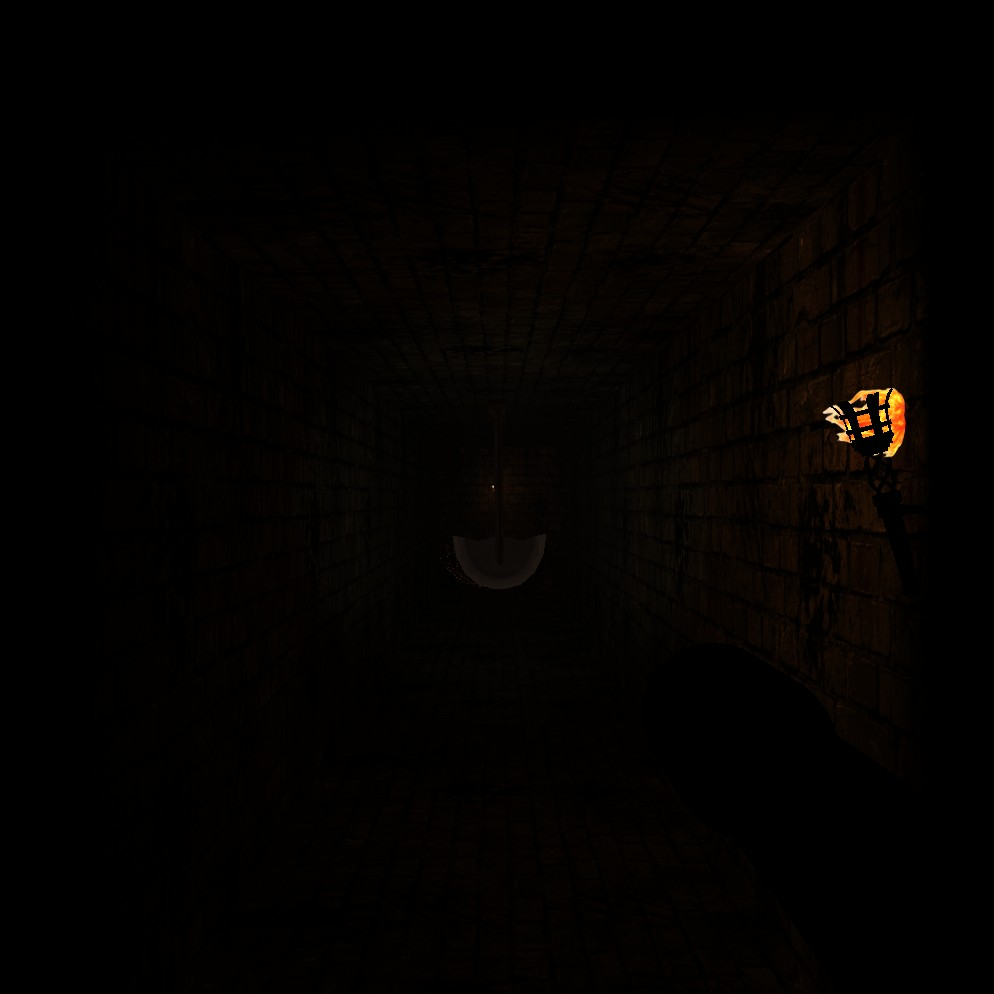

# Phobia - Laberinto de Terror en Primera Persona

**Proyecto Final - Informática Gráfica**  
**Grado en Ingeniería Informática**

---



---

## Descripción

**Phobia** es un juego de terror en primera persona desarrollado en C++ utilizando OpenGL moderno (Core Profile 3.3). El jugador debe escapar de un laberinto oscuro plagado de peligros mientras se guía únicamente con una linterna.

---

## Requisitos del Sistema

### Dependencias

| Librería | Versión Mínima | Descripción |
|----------|----------------|-------------|
| **OpenGL** | 3.3 Core Profile | API gráfica |
| **GLFW** | 3.3+ | Gestión de ventanas e input |
| **GLEW** | 2.1+ | Extensiones de OpenGL |
| **GLM** | 0.9.9+ | Matemáticas para gráficos |

### Herramientas de Compilación

- **CMake** 3.10 o superior
- **Compilador C++17** compatible (MSVC, GCC, Clang)

---

## Estructura del Proyecto

```
phobia/
├── CMakeLists.txt              # Configuración de CMake
├── README.md                   # Este archivo
├── MANUAL.md                   # Manual de usuario
├── src/                        # Código fuente
│   ├── main.cpp                # Punto de entrada
│   ├── Game.cpp/h              # Bucle principal del juego
│   ├── Scene.cpp/h             # Gestión de la escena y grafo
│   ├── Camera.cpp/h            # Cámara en primera persona
│   ├── Model.cpp/h             # Carga y renderizado de modelos
│   ├── Shaders.cpp/h           # Compilación y gestión de shaders
│   ├── Texture.cpp/h           # Carga de texturas
│   ├── InputManager.cpp/h      # Gestión de entrada (teclado/ratón)
│   ├── AudioManager.cpp/h      # Sistema de audio
│   ├── ResourceManager.cpp/h   # Gestión centralizada de recursos
│   ├── DoorManager.cpp/h       # Lógica de puertas interactivas
│   ├── PendulumManager.cpp/h   # Animación de péndulos
│   ├── TorchManager.cpp/h      # Gestión de la linterna
│   ├── ExitRoomManager.cpp/h   # Lógica de la sala de salida
│   ├── ExitSignManager.cpp/h   # Señales de emergencia
│   └── SpiderwebManager.cpp/h  # Decoración ambiental
├── libraries/                  # Librerías externas
│   ├── glew/                   # OpenGL Extension Wrangler
│   │   ├── include/
│   │   └── lib/
│   ├── glfw/                   # Framework de ventanas
│   │   ├── include/
│   │   └── lib/
│   ├── glm/                    # OpenGL Mathematics
│   │   └── include/
│   ├── assimp/                 # Asset Import Library
│   │   ├── include/
│   │   └── lib/
│   ├── freeimage/              # Librería de imágenes
│   │   ├── include/
│   │   └── lib/
│   ├── openal-soft-1.25.0-bin/ # Audio 3D
│   │   └── libs/
│   └── dlls/                   # DLLs necesarias
├── binary/                     # Ejecutable y recursos
│   └── resources/
│       ├── models/             # Modelos 3D y mapa
│       │   ├── map.cub         # Definición del laberinto
│       │   └── doors/          # Modelos de puertas
│       ├── shaders/            # Shaders GLSL
│       │   ├── vshader.glsl    # Vertex Shader
│       │   └── fshader.glsl    # Fragment Shader
│       ├── textures/           # Texturas del juego
│       │   ├── wall/           # Texturas de paredes
│       │   ├── doll/           # Texturas de objetos
│       │   ├── flashlight/     # Texturas de linterna
│       │   └── ...
│       └── audios/             # Efectos de sonido
└── build/                      # Directorio de compilación
```

---

## Compilación

### Windows (Visual Studio / MSVC)

```bash
# Clonar o descargar el proyecto
cd phobia

# Crear directorio de build
mkdir build
cd build

# Generar proyecto con CMake (Ninja)
cmake -G "Ninja" ..

# Compilar
cmake --build . --config Release

# El ejecutable se genera en binary/
```

### Windows (MinGW)

```bash
cmake -G "MinGW Makefiles" ..
mingw32-make
```

### Linux

```bash
# Instalar dependencias (Ubuntu/Debian)
sudo apt-get install libglfw3-dev libglew-dev libglm-dev

# Compilar
mkdir build && cd build
cmake ..
make -j$(nproc)
```

---

## Ejecución

```bash
cd binary
./phobia.exe    # Windows
./phobia        # Linux
```

> **Importante:** El ejecutable debe ejecutarse desde el directorio `binary/` para que encuentre correctamente la carpeta `resources/`.

---

## Implementación Técnica

### Sistema de Renderizado

- **OpenGL 3.3 Core Profile**: Pipeline programable moderno sin funciones deprecated.
- **VAO/VBO/EBO**: Gestión eficiente de geometría en GPU.
- **Shaders GLSL**: Vertex y Fragment shaders personalizados.

### Modelo de Iluminación (Phong)

El sistema implementa el modelo de iluminación **Phong** completo:

```
Color_final = Ambiente + Difusa + Especular
```

- **Componente Ambiental**: Luz base tenue (azul oscuro/gris) para atmósfera de terror.
- **Componente Difusa**: Cálculo con producto escalar `dot(N, L)`.
- **Componente Especular**: Reflejo especular con exponente de brillo.

### Fuentes de Luz

| Tipo | Descripción | Implementación |
|------|-------------|----------------|
| **Ambiental Global** | Luz tenue de ambiente | Color azul/gris de baja intensidad |
| **Spotlight (Linterna)** | Cono de luz adjunto a la cámara | Atenuación por distancia y ángulo de corte |
| **Direccional (Luna)** | Luz suave desde arriba | Simula luz lunar filtrándose |

### Cámara en Primera Persona

- **Movimiento**: Vectores `front`, `right`, `up` calculados desde ángulos Euler (pitch/yaw).
- **Head Bobbing**: Oscilación sinusoidal de la posición al caminar.
- **Linterna como Viewmodel**: La linterna se renderiza en espacio de cámara (brazo derecho).

### Objetos Articulados

#### Péndulo de la Muerte
- Generado proceduralmente con primitivas (cubos deformados).
- Jerarquía de transformaciones: `Base → Brazo → Hoja`.
- Animación automática: `angle = sin(time) * max_angle`.

#### Puertas Interactivas
- Detección de proximidad del jugador.
- Rotación interpolada de 90° al interactuar.
- Sistema de estados: `CLOSED → OPENING → OPEN`.

### Grafo de Escena

Estructura jerárquica simple para gestionar transformaciones:

```
Escena
├── Laberinto (paredes, suelo, techo)
├── Péndulos[]
│   └── Base → Brazo → Hoja
├── Puertas[]
└── Decoración (telarañas, señales)
```

### Generación del Laberinto

El mapa se carga desde `map.cub`, un archivo de texto donde cada carácter representa un elemento:

| Carácter | Elemento |
|----------|----------|
| `1` | Pared |
| `0` | Espacio vacío |
| `N/S/E/W` | Posición inicial (orientación) |
| `D` | Puerta |

---

## Controles

| Tecla | Acción |
|-------|--------|
| `W` | Avanzar |
| `A` | Izquierda |
| `S` | Retroceder |
| `D` | Derecha |
| `Ratón` | Girar cámara |
| `E` | Interactuar (abrir puertas) |
| `F` | Apagar/Encender linterna |
| `U` | Abrir/Cerrar minimapa |
| `ESC` | Salir del juego |

---

## Archivos de Configuración

### Shaders

- **vshader.glsl**: Transformación de vértices, paso de normales y coordenadas UV.
- **fshader.glsl**: Cálculo de iluminación Phong, muestreo de texturas, mezcla de luces.

### Formato del Mapa (map.cub)

```
111111111
100000001
101110101
100010001
100000001
111111111
```

---

## Créditos

### Autores

- **Jorge Sánchez Aguilar** - [@josanchdev](https://github.com/josanchdev)
- **Sergio Barrios Paz** - [@CodeInIA](https://github.com/CodeInIA)

### Recursos

- **Desarrollo**: Proyecto académico para Informática Gráfica
- **Librerías**: GLFW, GLEW, GLM (licencias respectivas)
- **Texturas**: Recursos propios y libres de derechos

---

## Licencia

Proyecto académico - Universidad - Curso 2025/2026

---
